# **LERM STACK IMPLEMENTATION ON AWS**

## **STEP 1 – INSTALLING THE NGINX WEB SERVER**
In order to display web pages to our site visitors, we are going to employ a high perfromance web server - Nginx. One of the many rerasons we chose this is because it can handle a high volume of connections

The first thing to do is to update the linux package repository with the command below:

`sudo apt update`

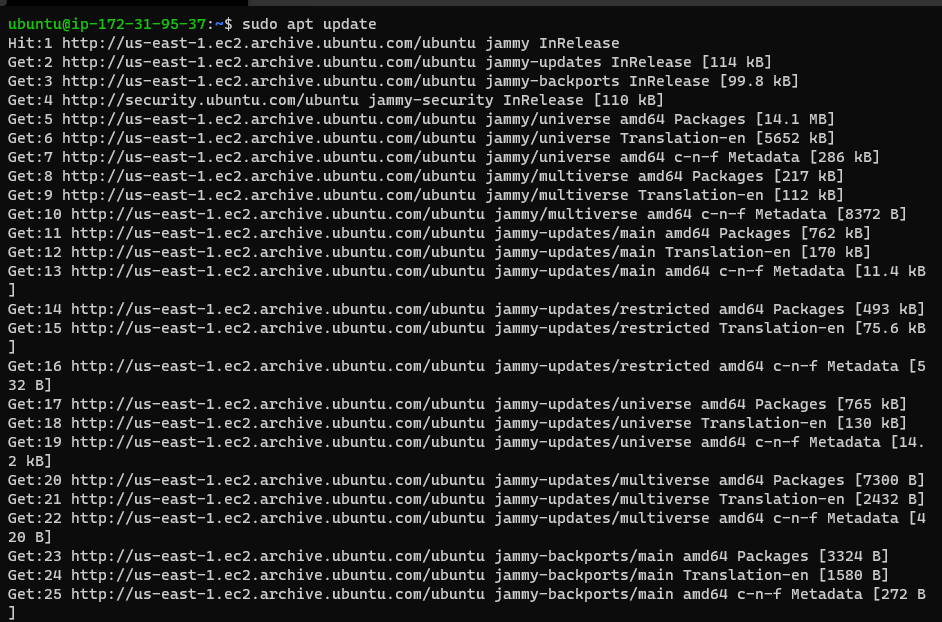

Now run Nginx package installation

`sudo apt install nginx`

When prompted, press Y to confirm that you wish to install Nginx. Once the installation is finished, your Ubuntu computer will have the Nginx web server up and running.

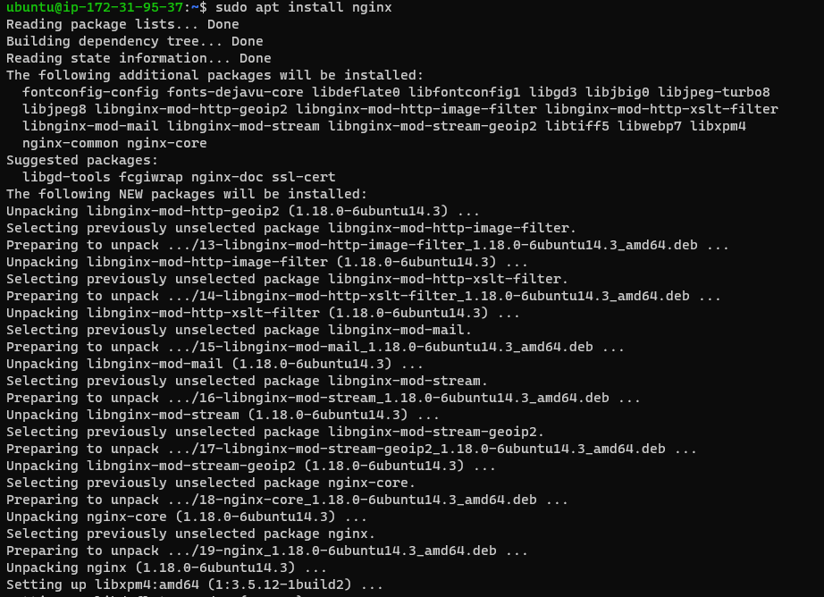

To verify that nginx was successfully installed and is running as a service in your ubuntu machine, run:

`sudo systemctl status nginx`

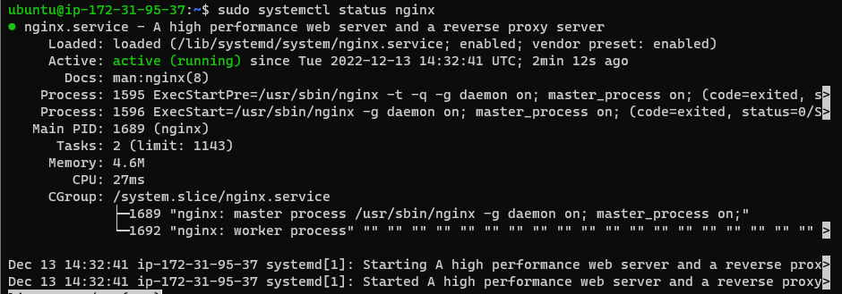

If it is green and running, you've done everything right
**Kudus to you! You have just launched your first Web Server in the Cloud!**

Before you can receive any traffic on your Web Server, you need make sure your security group settings on AWS allows TCP port 80 traffic (HTTP).

You can try to check if it is locally running on your Ubuntu terminal using the follwing commands

`curl http://localhost:80` **(Acccessing through DNS)**

`curl http://127.0.0.1:80` **(Accessing through the IP address)**

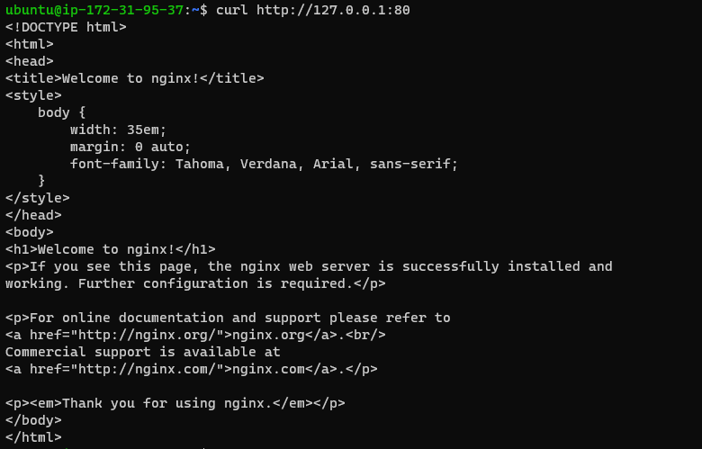

Test your Nginx HTTP server's ability to respond to requests coming from the Internet as the next stage.

Open a web browser of your choice and try to access following url

`http://<Public-IP-Address>` **(Public Address example: 55.11.22.226)**

To find your public IP address, please check your AWS console.

If you see the page below, your web server has been properly installed and is now accessible through your firewall.

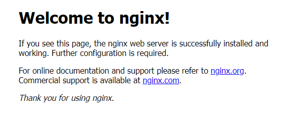

In fact, it is the same content that you previously got by ‘curl’ command, but represented in nice HTML formatting by your web browser.

## **STEP 2 - INSTALLING MYSQL (DBMS)**
Now that you have a web server running, you need a database to manage the data. To install the Database, use the command below:

`sudo apt install mysql-server`

*When prompted as highlighted with the red rectangle below, confirm installation by typing y, and then hit ENTER.*

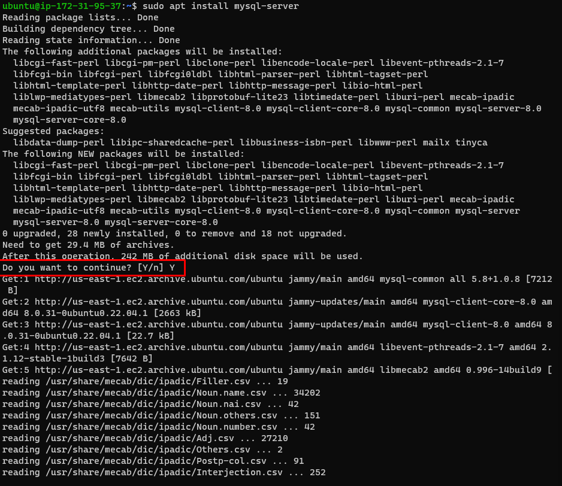


When the installation is complete, open the MySQL console by typing:

`sudo mysql`

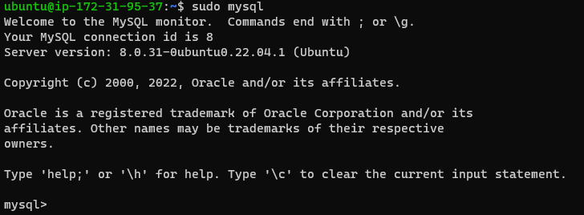

*The use of sudo while running this command implies that it will connect to the MySQL server as the administrator database user root.*

Running the security script that comes pre-installed with MySQL is highly advised. This script will lock down access to your database system and remove several unsafe default settings. You must create a password for the root user before executing the script, with mysql_native_password serving as the default authentication method. The password for this user is defined as PassWord.1.

`ALTER USER 'root'@'localhost' IDENTIFIED WITH mysql_native_password BY 'PassWord.1';`

Exit the MySQL shell with the `exit` command

Next step is to start the interactive script by running:

`sudo mysql_secure_installation`

After entering the root password, you will be asked if you want to configure the VALIDATE PASSWORD PLUGIN. Simply answer "y" for yes.

You will now be prompted to choose a password validation level. Remember that if you choose the strongest level of 2 and try to make a password that doesn't include numbers, upper and lowercase letters, special characters, you will get errors.

If you enabled password validation, you’ll be shown the password strength for the root password you just entered and your server will ask if you want to continue with that password. If you are happy with your current password, enter Y for “yes” at the prompt:

For the rest of the questions, **press Y and hit the ENTER key at each prompt.** This will prompt you to change the root password, remove some anonymous users and the test database, disable remote root logins, and load these new rules so that MySQL immediately respects the changes you have made.

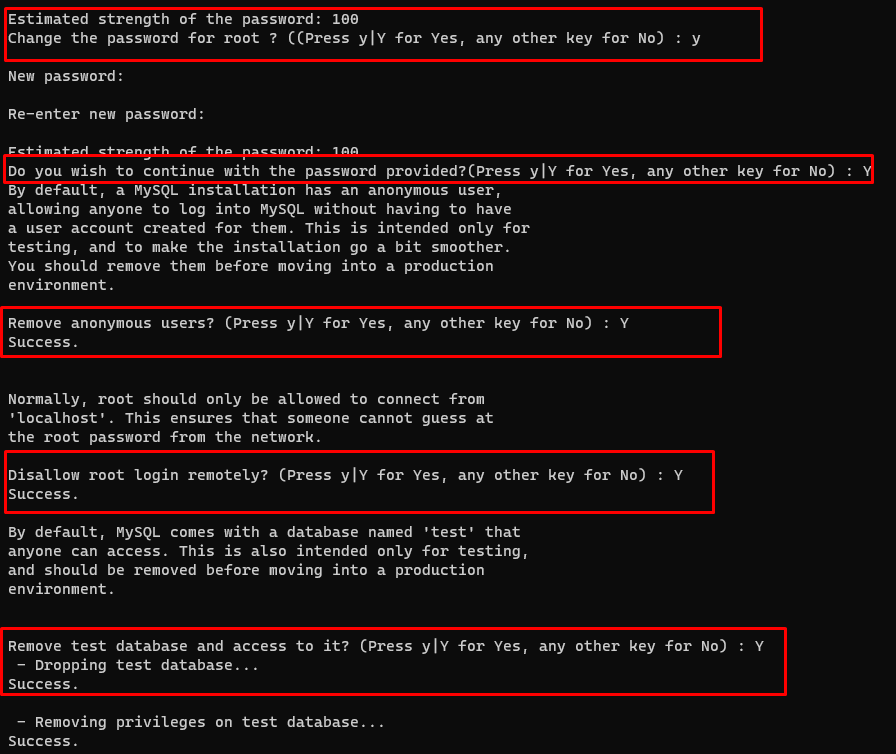

When you’re finished, test if you’re able to log in to the MySQL console by typing:

`sudo mysql -p`

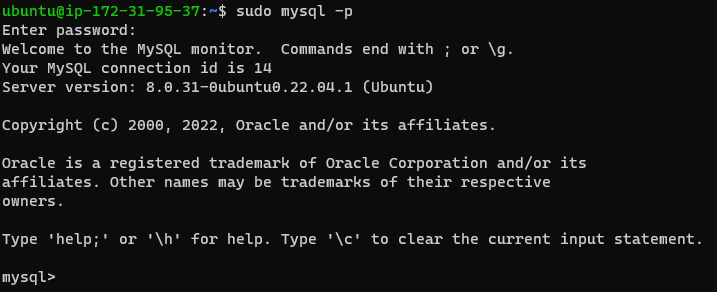

Notice the -p flag in this command, which will prompt you for the password used after changing the root user password.

To exit the MySQL console, type: `exit`

Your MySQL server is now installed and secured. Next, we will install PHP, the final component in the LEMP stack.

## **STEP 3 — INSTALLING PHP**

The reason we install PHP is to process code and produce dynamic contents for the web server.

Nginx needs an extra application to conduct PHP processing and serve as a bridge between the PHP interpreter and the web server, whereas Apache embeds the PHP interpreter in each request. Most PHP-based websites can perform better overall thanks to this, but it necessitates more tweaking. Install php-fpm, which stands for "PHP fastCGI process manager," then instruct Nginx to send PHP requests to this program for processing. You also require the PHP module php-mysql, which enables communication between PHP and MySQL-based databases. Dependencies for the core PHP packages will be installed automatically.

Run the following commands to install these 2 packages simultaneously:

`sudo apt install php-fpm php-mysql`

When prompted, type **Y** and press **ENTER** to confirm installation.

You now have your PHP components installed. Next, you will configure Nginx to use them.


## **STEP 4 — CONFIGURING NGINX TO USE PHP PROCESSOR**

The Nginx web server allows us to establish server blocks, which are similar to virtual hosts in Apache. It allows us to host several domains on a single server by encapsulating configuration information.

On Ubuntu 22.04, Nginx has one server block enabled by default and is configured to serve documents out of a directory at `/var/www/html`. While this works well for a single site, it can become difficult to manage if you are hosting multiple sites. Instead of modifying `/var/www/html`, we’ll create a directory structure within `/var/www` for your domain website, leaving /var/www/html in place as the default directory to be served if a client request does not match any other sites.

Create the root web directory for your domain as follows:

`sudo mkdir /var/www/projectLEMP`

Next, assign ownership of the directory with the $USER environment variable, which will reference your current system user:

`sudo chown -R $USER:$USER /var/www/projectLEMP`

Then, open a new configuration file in Nginx’s sites-available directory using your preferred command-line editor. Here, we’ll use nano:

`sudo nano /etc/nginx/sites-available/projectLEMP`

This will create a new blank file. Paste in the following configuration:

```
#/etc/nginx/sites-available/projectLEMP
 
server {
    listen 80;
    server_name projectLEMP www.projectLEMP;
    root /var/www/projectLEMP;
 
    index index.html index.htm index.php;
 
    location / {
        try_files $uri $uri/ =404;
    }
 
    location ~ \.php$ {
        include snippets/fastcgi-php.conf;
        fastcgi_pass unix:/var/run/php/php8.1-fpm.sock;
     }
 
    location ~ /\.ht {
        deny all;
    }
 
}
```

Here’s what each of these directives and location blocks do:

- **listen —** Defines what port Nginx will listen on. In this case, it will listen on port 80, the default port for HTTP.

- **root —** Defines the document root where the files served by this website are stored.

- **index —** Defines in which order Nginx will prioritize index files for this website. It is a common practice to list index.html files with a higher precedence than index.php files to allow for quickly setting up a maintenance landing page in PHP applications. You can adjust these settings to better suit your application needs.

- **server_name —** Defines which domain names and/or IP addresses this server block should respond for. Point this directive to your server’s domain name or public IP address.

- **location / —** The first location block includes a try_files directive, which checks for the existence of files or directories matching a URI request. If Nginx cannot find the appropriate resource, it will return a 404 error.

- **location ~ \.php$ —** This location block handles the actual PHP processing by pointing Nginx to the fastcgi-php.conf configuration file and the php7.4-fpm.sock file, which declares what socket is associated with php-fpm.

- **location ~ /\.ht —** The last location block deals with .htaccess files, which Nginx does not process. By adding the deny all directive, if any .htaccess files happen to find their way into the document root, they will not be served to visitors.

When you’re done editing, save and close the file. If you’re using nano, you can do so by typing **CTRL+X and then y and ENTER to confirm.**

Activate your configuration by linking to the config file from Nginx’s sites-enabled directory:

`sudo ln -s /etc/nginx/sites-available/projectLEMP /etc/nginx/sites-enabled/`

This will tell Nginx to use the configuration next time it is reloaded. You can test your configuration for syntax errors by typing:

`sudo nginx -t`

You shall see following message:

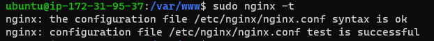

If any errors are reported, go back to your configuration file to review its contents before continuing.

We also need to disable default Nginx host that is currently configured to listen on port 80, for this run:

`sudo unlink /etc/nginx/sites-enabled/default`

When you are ready, reload Nginx to apply the changes:

`sudo systemctl reload nginx`

Your new website is now active, but the web root /var/www/projectLEMP is still empty. Create an index.html file in that location so that we can test that your new server block works as expected:

`sudo echo 'Hello LEMP from hostname' $(curl -s http://169.254.169.254/latest/meta-data/public-hostname) 'with public IP' $(curl -s http://169.254.169.254/latest/meta-data/public-ipv4) > /var/www/projectLEMP/index.html`

Now go to your browser and try to open your website URL using IP address:

`http://<Public-IP-Address>:80`


You can leave this file in place as a temporary landing page for your application until you set up an index.php file to replace it. Once you do that, remember to remove or rename the index.html file from your document root, as it would take precedence over an index.php file by default.

Your LEMP stack is now fully configured. In the next step, we’ll create a PHP script to test that Nginx is in fact able to handle .php files within your newly configured website.


## **STEP 5 – TESTING PHP WITH NGINX**

Your LEMP stack should now be completely set up.

You can test it to validate that Nginx can correctly hand .php files off to your PHP processor.

You can do this by creating a test PHP file in your document root. Open a new file called info.php within your document root in your text editor:

`sudo nano /var/www/projectLEMP/info.php`

Type or paste the following lines into the new file. This is valid PHP code that will return information about your server:

```
<?php
phpinfo();
```

You can now access this page in your web browser by visiting the domain name or public IP address you’ve set up in your Nginx configuration file, followed by /info.php:

`http://server_domain_or_IP/info.php`

You will see a web page containing detailed information about your server:

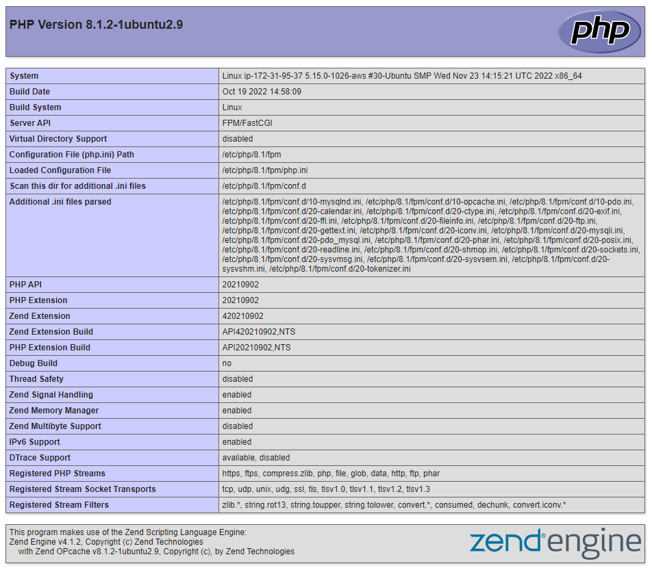

After checking the relevant information about your PHP server through that page, it’s best to remove the file you created as it contains sensitive information about your PHP environment and your Ubuntu server. You can use rm to remove that file:

`sudo rm /var/www/your_domain/info.php`

You can always regenerate this file if you need it later.

## **STEP 6 – RETRIEVING DATA FROM MYSQL DATABASE WITH PHP**

In this step you will create a test database with simple "To do list" and configure access to it, so the Nginx website would be able to query data from the DB and display it.

We’ll need to create a new user with the mysql_native_password authentication method in order to be able to connect to the MySQL database from PHP.

We will create a database named Daniel_DB and a user named Daniel, but you can replace these names with any name of your choice.

First, connect to the MySQL console using the root account:

`sudo mysql`

To create a new database, run the following command from your MySQL console:

```
`CREATE DATABASE `Daniel_DB`;
```

Now you can create a new user and grant him full privileges on the database you have just created.

The following command creates a new user named **Daniel,** using mysql_native_password as default authentication method. We’re defining this user’s password as **Dan!el@1,** but you should replace this value with a secure password of your own choosing.

`CREATE USER 'Daniel'@'%' IDENTIFIED WITH mysql_native_password BY 'Dan!el@1';`

Now we need to give this user permission over the Daniel_DB database:

`GRANT ALL ON Daniel_DB.* TO 'Daniel'@'%';`

This will give the **Daniel user full privileges over the Daniel_DB database, while preventing this user from creating or modifying other databases on your server.**


Now exit the MySQL shell with: `exit`

You can test if the new user has the proper permissions by logging in to the MySQL console again, this time using the custom user credentials:

`mysql -u example_user -p`

Notice the -p flag in this command, which will prompt you for the password used when creating the Daniel user. After logging in to the MySQL console, confirm that you have access to the Daniel_DB database:

`SHOW DATABASES;`

This will give you the following output:

```
mysql> SHOW DATABASES;
+--------------------+
| Database           |
+--------------------+
| Daniel_DB          |
| information_schema |
| performance_schema |
+--------------------+
3 rows in set (0.02 sec
```

Next, we’ll create a test table named todo_list. From the MySQL console, run the following statement:

```
CREATE TABLE Daniel_DB.todo_list (
    -> item_id INT AUTO_INCREMENT,
    -> Content VARCHAR(255),
    -> PRIMARY KEY(item_id)
    -> );
```


Insert a few rows of content in the test table. You might want to repeat the next command a few times, **using different VALUES:**

`mysql> INSERT INTO Daniel_DB.todo_list (content) VALUES ("Visit a friend");`

To confirm that the data was successfully saved to your table, run:

`mysql> SELECT * FROM Daniel_DB.todo_list;`

You’ll see the following output:

```
+---------+----------------+
| item_id | Content        |
+---------+----------------+
|       1 | Visit a friend |
|       2 | Get a hair cut |
|       3 | Go to the gym  |
+---------+----------------+
3 rows in set (0.00 sec)
```

After confirming that you have valid data in your test table, you can exit the MySQL console:

`mysql> exit`

Now you can create a PHP script that will connect to MySQL and query for your content. Create a new PHP file in your custom web root directory using your preferred editor. We’ll use vi for that:

`nano /var/www/projectLEMP/todo_list.php`

The following PHP script connects to the MySQL database and queries for the content of the todo_list table, displays the results in a list. If there is a problem with the database connection, it will throw an exception.

Copy this content into your todo_list.php script: 

```
<?php
$user = "Daniel";
$password = "Dan!el@1";
$database = "Daniel_DB";
$table = "todo_list";
 
try {
  $db = new PDO("mysql:host=localhost;dbname=$database", $user, $password);
  echo "<h2>TODO</h2><ol>";
  foreach($db->query("SELECT content FROM $table") as $row) {
    echo "<li>" . $row['content'] . "</li>";
  }
  echo "</ol>";
} catch (PDOException $e) {
    print "Error!: " . $e->getMessage() . "<br/>";
    die();
}
```

Save and close the file when you are done editing.

You can now access this page in your web browser by visiting the domain name or public IP address configured for your website, followed by /todo_list.php:

http://<Public_domain_or_IP>/todo_list.php

You should see a page like this, showing the content you’ve inserted in your test table:


This indicates that your PHP environment is ready to interact with your MySQL server.